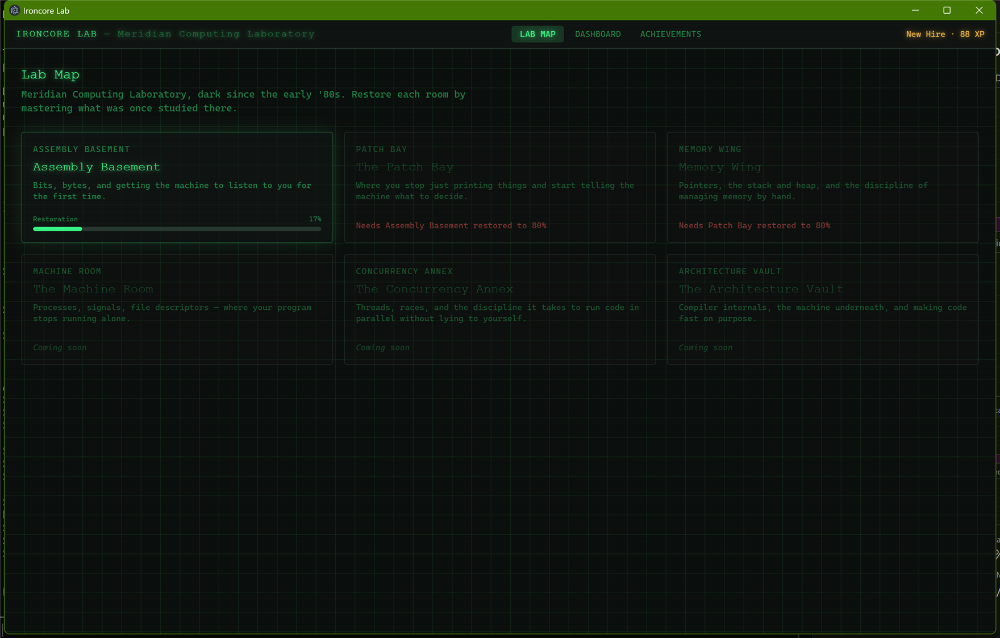

# Ironcore Lab

**Learn C by restoring a dead computing laboratory — with a real Linux toolchain under the hood, not a toy simulator.**

Ironcore Lab is a desktop app that teaches C from bits to bare metal. Every exercise compiles and runs against **actual gcc/clang, gdb, and Valgrind** inside WSL. The compiler errors are real compiler errors. The memory leaks are real memory leaks. The narrative wrapper — restoring the abandoned "Meridian Computing Laboratory" room by room — is there to give the curriculum shape, not to paper over how C actually behaves.

> **Status:** early (`v0.1.0`), Windows + WSL only, single author. Three of six planned arcs are fully authored; see [Content roadmap](#content-roadmap) below.



## Why a real toolchain

Most browser-based "learn C" tools run your code in a sandboxed interpreter or a heavily restricted WASM build. That's fine for syntax, but it quietly lies to you about the parts of C that actually trip people up: undefined behavior, real compiler diagnostics, real memory corruption. Ironcore Lab shells out to your own WSL Ubuntu install and runs the genuine article:

- `gcc`/`clang` with `-Wall -Wextra`, so warnings look like the warnings you'll see everywhere else
- `gdb -batch` for guided debugging lessons
- `valgrind` for memory-leak lessons, plus AddressSanitizer/UBSan on relevant exercises
- Real exit codes, real stdout/stderr, real timeouts and memory limits per exercise

## Features

- **Six-arc curriculum**, from "what is a bit" through pointers, structs, processes, concurrency, and compiler internals
- **Monaco-based editor** (the engine behind VS Code) for every coding exercise
- **Five exercise types** — write-program, fix-the-bug, predict-output, fill-in-blank, and guided gdb debugging — each graded appropriately (WSL round-trip vs. instant client-side check)
- **Setup Wizard** that detects your WSL/Ubuntu toolchain, tells you exactly what's missing, and offers one-click buttons to install it — rather than failing silently mid-lesson or expecting you to already know WSL
- **XP, achievements, and an in-app error glossary** that recognizes real gcc/clang/Valgrind/sanitizer output and links it back to the lesson that explains it
- **Data-driven content** — every lesson and exercise is JSON validated by Zod at load time (see [Content roadmap](#content-roadmap)); adding a lesson never requires touching app code

## Install

**Requirement either way:** Windows 10/11. (WSL2 + Ubuntu is also required to actually compile/run C code, but you don't need to set that up yourself first — see below.)

### Option A — Installer (recommended if you just want to use it)

1. Download the latest `Ironcore Lab Setup x.x.x.exe` from [Releases](https://github.com/druxck/ironcore-lab/releases).
2. Run it and step through the installer (pick an install location, create shortcuts, etc.).
   > The installer isn't code-signed (that costs money a one-person hobby project doesn't have), so Windows SmartScreen will likely show an "unrecognized app" warning. Click **More info → Run anyway**. This is normal for small independent Windows apps, not a sign anything's wrong — you're welcome to inspect [the source](https://github.com/druxck/ironcore-lab) or [the packaging workflow](.github/workflows/ci.yml) first.
3. Launch **Ironcore Lab**. If WSL/Ubuntu or the C toolchain (gcc, clang, gdb, valgrind, etc.) aren't already on your machine, the **Setup Wizard** screen will offer one-click **Install WSL + Ubuntu** and **Install C Toolchain** buttons — each just opens the real Windows permission prompt or a terminal for `sudo`, since neither of those can be (or should be) done silently. No existing WSL/Windows/npm knowledge required; see [`docs/setup-manual.md`](docs/setup-manual.md) for exactly what each button does and the manual fallback.
4. Once every tool shows green, the Lab Map unlocks.

### Option B — From source (for developers)

```bash
git clone https://github.com/druxck/ironcore-lab.git
cd ironcore-lab
npm install
npm run dev
```

Same Setup Wizard, same one-click install buttons, just running from source instead of a packaged build. To build your own installer: `npm run dist:win` (produces `release/Ironcore Lab Setup x.x.x.exe` via electron-builder).

## Content roadmap

| Arc | Status |
|---|---|
| Assembly Basement — bits, bytes, the toolchain | Authored |
| The Patch Bay — variables, control flow, functions | Authored |
| Memory Wing — pointers, stack/heap, structs | Authored |
| The Machine Room — processes, signals, file descriptors | Outline |
| The Concurrency Annex — threads and races | Outline |
| The Architecture Vault — compiler internals, performance | Outline |

Contributions toward the outlined arcs are welcome — see [Contributing](#contributing).

## How it works

- **`src/main`** — Electron main process: WSL bridge (spawns `wsl.exe`, streams output), toolchain detection, content loader (Zod-validated JSON), save-file migrations
- **`src/renderer`** — React/TypeScript UI: Lab Map, Lesson View, Setup Wizard, Dashboard, Achievements
- **`src/shared`** — types shared across the Electron process boundary via a typed IPC contract
- **`content/`** — the entire curriculum as data (arcs, lessons, exercises, error glossary, history trivia); see [`docs/content-authoring-guide.md`](docs/content-authoring-guide.md) for the full spec

## Development

```bash
npm run dev         # run the app in development
npm run typecheck   # TypeScript, no emit
npm run lint        # ESLint
npm test            # unit tests (pure logic, no WSL required)
npm run test:wsl    # integration tests against the real compile pipeline (requires WSL setup above)
npm run build        # production build (unpacked)
npm run dist:win     # packaged Windows installer (release/*.exe)
```

## Contributing

Bug reports and PRs are welcome, especially:

- New lessons/exercises for the outlined arcs (Machine Room, Concurrency Annex, Architecture Vault) — content is pure JSON/Markdown and doesn't require touching app code. Start with [`docs/content-authoring-guide.md`](docs/content-authoring-guide.md).
- Additions to the error glossary (`content/error-glossary/`) for compiler/Valgrind/sanitizer output that isn't recognized yet.

Please run `npm run typecheck && npm run lint && npm test` before opening a PR.

## License

[MIT](LICENSE)
